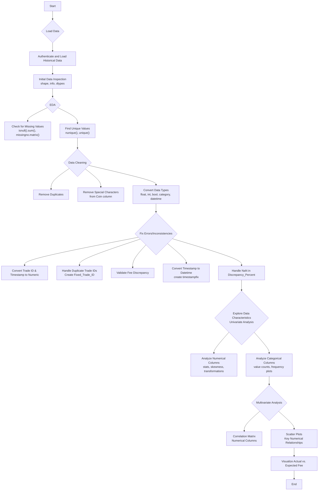

# ds_dandangi_raj-PrimeTradeAI-

---

this projects aimed on the  objective is to explore the relationship between trader performance and market 
sentiment, uncover hidden patterns, and deliver insights that can drive smarter trading 
strategies.
provided assests : 1.Historical Trader Data from Hyperliquid  , 2. Bitcoin Market Sentiment Dataset

---

step 1 : work flowchart & steps performed on dataset 1. Historical Trader Data from Hyperliquid

