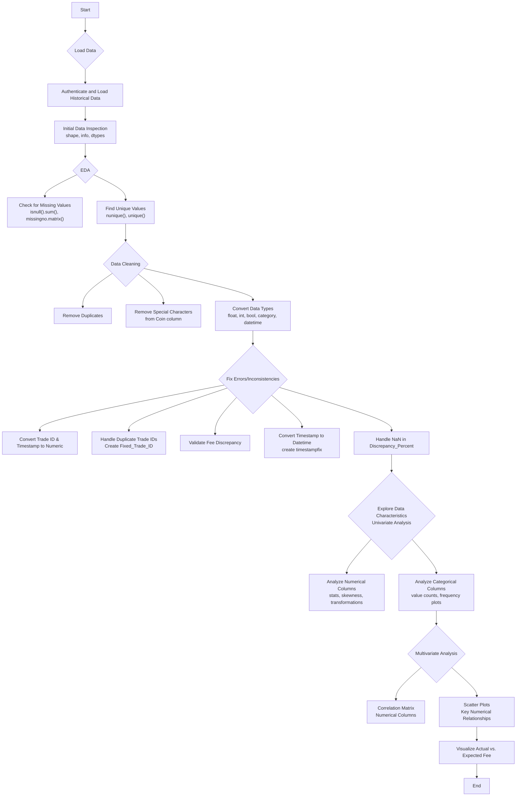
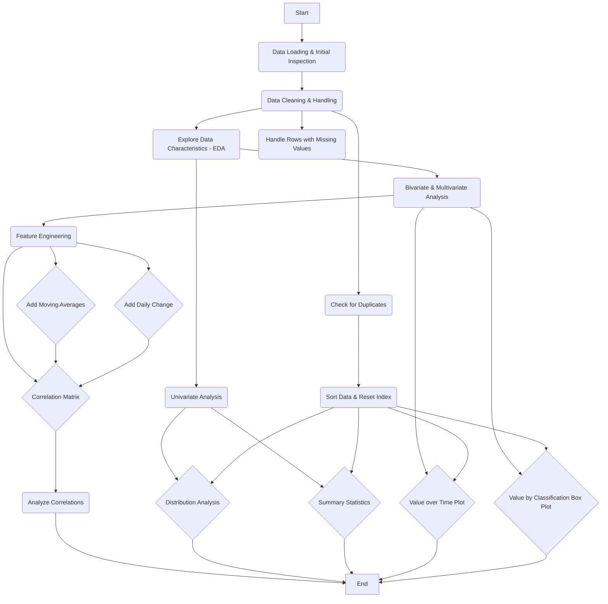
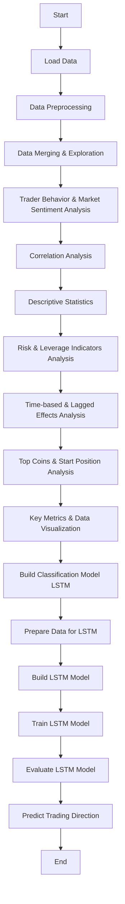

# ds_dandangi_raj-PrimeTradeAI-

---

this projects aimed on the  objective is to explore the relationship between trader performance and market 
sentiment, uncover hidden patterns, and deliver insights that can drive smarter trading 
strategies.
provided assests : 1.Historical Trader Data from Hyperliquid  , 2. Bitcoin Market Sentiment Dataset

---

step 1 : work flowchart & steps performed on dataset 1. Historical Trader Data from Hyperliquid

Please [click-here](html_report_files/note_book_1.pdf) to view the full report 

---

step 2 :  work flowchart & steps performed on dataset 2. Historical Trader Data 

Please [click-here](html_report_files/note_book_2.pdf) to view the full report 

---

step 3 : Trader Behavior & Market Sentiment

Please [click-here](html_report_files/note_book_3.pdf) to view the full report 

---

## 📊 Analysis Summary: Trader Behavior & Market Sentiment

This analysis explores the complex relationship between Bitcoin market sentiment (Fear & Greed Index) and Hyperliquid trader behavior, focusing on profitability, volume, leverage, and risk.

### 🌟 **Executive Summary**

*   **Beyond Simple Correlation:** While a direct linear link between sentiment and average profitability is weak, sentiment strongly influences market **volatility** 📉 and **trader behavior** 🧠 (e.g., position sizing).
*   **The Outlier Effect:** Average profits are skewed by a few highly successful trades; the **median profit is near zero** across all sentiment levels.
*   **Market Impact Alert:** **Large token-quantity trades** are strongly negatively correlated with execution price, indicating significant **market impact costs** 💸.
*   **Strategic Takeaway:** Use sentiment as a **contextual indicator for risk and sizing**, and **prioritize execution optimization** ⚙️ for large trades.

### 🔑 **Key Insights**

*   **💰 Profitability: The Tale of Two Averages**
    *   **Mean vs. Median:** Large outliers significantly skew average PnL; the median PnL remains close to zero.
    *   **Sentiment & Averages:** Higher average profits in 'Greed', average losses in 'Fear', but **median profitability is consistently low**.
    *   **Localized Opportunities:** Specific price ranges within sentiment categories can show higher mean PnL.

*   **📈 Trade Volume & Execution Efficiency**
    *   **Sentiment Shifts:** 'Greed' periods see higher USD volume; 'Fear' periods see higher relative token volume.
    *   **Market Impact:** **Large trades (high token qty) negatively impact execution price**, suggesting poor efficiency or timing.
    *   **Volume Trends:** Trade size (USD) tends to increase with higher price ranges.

*   **⚠️ Risk & Leverage: Trading on the Edge**
    *   **Leverage & Sentiment:** Average leverage is highest in 'Extreme Greed'.
    *   **High Risk in Fear:** High-leverage trades have a **much lower win rate during 'Extreme Fear'**.
    *   **Position Sizing:** Larger initial positions (start position) align with 'Greed' periods, indicating higher conviction.

---

## 🎯 Strategic Recommendations for Traders

*   **🔍 Tip 1: Focus on High-Conviction Trades**
    *   During "Greed" periods, concentrate on trades with strong technical and fundamental backing, rather than chasing every opportunity, to overcome the zero-median profitability challenge and apply this insight to your own trades.

*   **⚠️ Tip 2: Monitor Extreme Sentiment Spikes**
    *   Pay close attention to 'Fear' and 'Extreme Greed' periods, as they may signal increased volatility and higher-risk plays by other market participants.

*   **📈 Tip 3: Analyze High-Leverage Outcomes**
    *   Deep-dive into the success/failure rates of large, high-leverage positions taken during extreme sentiments to refine your own risk management.

*   **🛡️ Tip 4: Adapt Volume Composition**
    *   Consider how the dominant trading volume (USD vs. token) shifts with sentiment and adjust your asset focus accordingly.

---

## 🔍 Lagged Correlation Analysis: Yesterday's Sentiment vs. Today's Trading

Analyzing whether **yesterday's** Fear & Greed Index score can predict **today's** trading outcomes reveals some key insights:

*   **🌀 1. No Strong Link Between Yesterday's Sentiment and Today's Results**
    *   Our analysis indicates that **yesterday's overall market sentiment (Fear & Greed Index) has a very weak connection** to today's trading profitability or the volume of trades (in USD or tokens).

*   **📊 2. Weak Influence on Profitability**
    *   A higher or lower sentiment value from the previous day **does not strongly predict** whether traders will be more or less profitable today. The correlation observed is almost zero.

*   **📉 3. Minimal Impact on Trading Volume**
    *   There's only a **very slight, almost negligible, tendency** for today's USD trading volume to be lower if yesterday's sentiment was higher, and a similarly weak tendency for token volume to be slightly higher.

*   **❓ 4. Sentiment Alone Isn't a Predictor**
    *   In simple terms, relying solely on yesterday's Fear & Greed Index value is **not a reliable way to forecast** today's overall trader behavior, including profitability or trading volume. Other factors are likely more influential.

---

## � LSTM Model Predictions for Next Trading Period

Based on the LSTM model trained on historical data for the top 15 coins by USD trade volume, here are the key predictions:

*   **� Majority Sell Predictions:** For most of the top 15 coins, the LSTM model predicted a 'Sell' direction (represented by 0) for the next trading period.
*   **� Limited Buy Predictions:** Only one coin, **TOKEN142**, received a 'Buy' prediction (represented by 1).
*   **� Potential Interpretation:**
    *   The model's output suggests a predominantly **bearish or cautious outlook** for the near future across these major traded assets.
    *   The singular 'Buy' signal for TOKEN142 could indicate a unique pattern or momentum specific to that coin's recent history within the model's context.
    *   It's important to note that these predictions are based solely on the historical data and features used for these specific coins and should be interpreted within the model's limitations.

---
